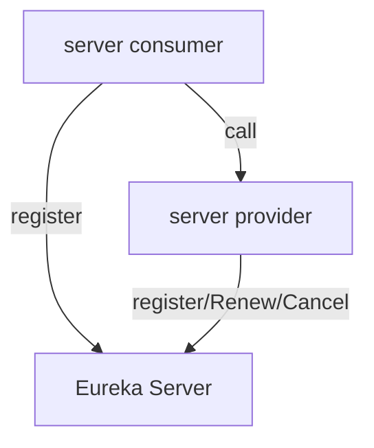

# 分布式
## 注册中心
基础的架构:
1. 一个服务提供者
2. 一个消费者
3. 服务者和消费者都注册到注册中心

相关依赖
```xml
<properties>
        <project.build.sourceEncoding>UTF-8</project.build.sourceEncoding>
        <maven.compiler.source>1.8</maven.compiler.source>
        <maven.compiler.target>1.8</maven.compiler.target>
        <junit.version>4.12</junit.version>
        <log4j.version>1.2.17</log4j.version>
        <lombok.version>1.16.18</lombok.version>
        <mysql.version>8.0.19</mysql.version>
        <druid.version>1.1.16</druid.version>
        <spring.boot.version>2.2.2.RELEASE</spring.boot.version>
        <spring.cloud.version>Hoxton.SR1</spring.cloud.version>
        <spring.cloud.alibaba.version>2.1.0.RELEASE</spring.cloud.alibaba.version>
        <mybatis.spring.boot.version>1.3.0</mybatis.spring.boot.version>
        <mybatis-spring-boot-starter.version>2.1.1</mybatis-spring-boot-starter.version>
        <xs.common>1.0-SNAPSHOT</xs.common>
    </properties>
    <!--子模块继承后,提供作用:锁定版本+子module不用groupId和version-->
    <dependencyManagement>
        <dependencies>
            <!--springboot 2.2.2-->
            <dependency>
                <groupId>org.springframework.boot</groupId>
                <artifactId>spring-boot-dependencies</artifactId>
                <version>${spring.boot.version}</version>
                <type>pom</type>
                <scope>import</scope>
            </dependency>
            <!--Spring cloud Hoxton.SR1-->
            <dependency>
                <groupId>org.springframework.cloud</groupId>
                <artifactId>spring-cloud-dependencies</artifactId>
                <version>${spring.cloud.version}</version>
                <type>pom</type>
                <scope>import</scope>
            </dependency>
            <!--Spring cloud alibaba 2.1.0.RELEASE-->
            <dependency>
                <groupId>com.alibaba.cloud</groupId>
                <artifactId>spring-cloud-alibaba-dependencies</artifactId>
                <version>${spring.cloud.alibaba.version}</version>
                <type>pom</type>
                <scope>import</scope>
            </dependency>
            <dependency>
                <groupId>mysql</groupId>
                <artifactId>mysql-connector-java</artifactId>
                <version>${mysql.version}</version>
            </dependency>
            <dependency>
                <groupId>com.alibaba</groupId>
                <artifactId>druid</artifactId>
                <version>${druid.version}</version>
            </dependency>
            <dependency>
                <groupId>org.mybatis.spring.boot</groupId>
                <artifactId>mybatis-spring-boot-starter</artifactId>
                <version>${mybatis-spring-boot-starter.version}</version>
            </dependency>
            <dependency>
                <groupId>org.projectlombok</groupId>
                <artifactId>lombok</artifactId>
                <version>${lombok.version}</version>
            </dependency>
            <dependency>
            <groupId>com.xs</groupId>
            <artifactId>cloud-commons</artifactId>
            <version>${xs.common}</version>
        </dependency>
        </dependencies>
    </dependencyManagement>
```
eureka配置:
单机版配置  
**依赖:**
```xml
<!--服务端-->
  <dependency>
        <groupId>org.springframework.cloud</groupId>
        <artifactId>spring-cloud-starter-netflix-eureka-server</artifactId>
    </dependency>
<!--客户端-->
<dependency>
    <groupId>org.springframework.cloud</groupId>
    <artifactId>spring-cloud-starter-netflix-eureka-client</artifactId>
</dependency>
旧版本
<dependency>
<groupId>org.springframework.cloud</groupId>
<artifactId>spring-cloud-starter-eureka</artifactId>
</dependency>
```
**注解:**
```xml
@EnableEurekaClient
@EnableEurekaServer
```
服务端配置:
```yaml
server:
  port: 7001
eureka:
  instance:
    hostname: localhost #服务端的实例名称
  client:
    # 不向注册中心注册自己
    register-with-eureka: false
    #    表示自己就是注册中心.维护服务实例,不去检索服务
    fetch-registry: false
    service-url:
      #      设置Eureka Server交互的地址查询和注册服务都需要依赖这个地址
      defaultZone: http://${eureka.instance.hostname}:${server.port}
```
客户端:
```yaml
eureka:
  client:
#    把自己注册到eurekaServer
    register-with-eureka: true
#    是否从eurekaService 抓取自己的注册信息,默认为true,单点无所谓,集群是设置为true,才能配合Robbie负载均衡
    fetch-registry: true
    service-url:
      defaultZone: http://localhost:7001/eureka
```
集群配置:
相互注册,相互守望:互相注册
修改host的配置
```yaml
 
127.0.0.1       xs-shuaieureka001.com
127.0.0.1       xs-shuaieureka002.com
```
两个注册中心相互注册
```yaml
server:
  port: 7001
eureka:
  instance:
    hostname: xs-shuaieureka001 #服务端的实例名称
  client:
    # 不向注册中心注册自己
    register-with-eureka: false
    #    表示自己就是注册中心.维护服务实例,不去检索服务
    fetch-registry: false
    service-url:
      #      设置Eureka Server交互的地址查询和注册服务都需要依赖这个地址
      defaultZone: http://localhost:7001/eureka/
```
客户端的注册
```yaml
http://localhost:7002/eureka/,http://localhost:7001/eureka/
```
消费者的配置
1.修改链接为服务名
2.resetTemplate 添加负载均衡
```java

@Configuration
public class ApplicationContextConfig {
    @Bean
    @LoadBalanced //负载均衡
    public RestTemplate getResetTemplate(){
        return new RestTemplate();
    }
}
```

主机名称和服务名称的配置:actuator
主机名称修改:
```yaml
eureka:
  client:
#    把自己注册到eurekaServer
    register-with-eureka: true
#    是否从eurekaService 抓取自己的注册信息,默认为true,单点无所谓,集群是设置为true,才能配合Robbie负载均衡
    fetch-registry: true
    service-url:
      defaultZone: http://localhost:7002/eureka/,http://localhost:7001/eureka/
 # 服务信息
  instance:
    instance-id: payment8001
# 访问信息ip信息提示
     prefer-ip-address: true
```

### 服务发现


```java
@Resource
private DiscoveryClient discoveryClient;


 @GetMapping(value = "/payment/discovery")
    public CommonResult getDiscovery(){
        List<String> services = discoveryClient.getServices();
        
        List<ServiceInstance> instances = discoveryClient.getInstances("PRIVDER-PAYMENT-SERVICE");
        instances.stream().forEach(x->{
            log.info(x.getInstanceId()+
                    "主机:"+x.getHost()+
                    "端口:"+x.getPort()+
                    "url"+x.getUri());
        });
        return  CommonResult.okData(instances);
    }
```
Eureka的自我保护机制
1. 某一时刻微服务不可用,eureka不会立即清理,依旧会对该服务信息进行保护(AP)
2. 定时发送心跳包,在临时的没有接受到,不会立即删除
3. 宁可保留错误的信息,也不会盲目删除可能的健康服务实例

禁止自我保护:
```yaml
服务端
eureka: 
    server:
        rate-limiter-enabled: false
# 
        eviction-interval-timer-in-ms: 2000
#客户端
#eureka: 
  instance:
    instance-id: payment8001
    prefer-ip-address: true
#    向客户端发送的心跳时间间隔单位秒(默认30)
    lease-renewal-interval-in-seconds: 1
#      最后一次心跳等待的时间默认90秒  超时剔除
    lease-expiration-duration-in-seconds: 2
```

## Zookeeper
eureka停止更新,

```
zookeeper的安装:
进入容器,到bin目录下,启动
> ./zkCli.sh
进入
> ls /services 
查看注册的服务

```
节点是临时性的,在关闭服务一段时间丢失,再次注册服务的id变化

客户端配置
pom
```xml
<!--修改eureka-->
<!--     zookeeper   -->
        <dependency>
            <groupId>org.springframework.cloud</groupId>
            <artifactId>spring-cloud-starter-zookeeper-discovery</artifactId>
<!--     版本冲突       -->
<!--            <exclusions>-->
<!--                <exclusion>-->
<!--                    <groupId>org.apache.zookeeper</groupId>-->
<!--                    <artifactId>zookeeper</artifactId>-->
<!--                </exclusion>-->
<!--            </exclusions>-->
        </dependency>

```
yml
```yaml
server:
  port: 8004

spring:
  application:
#    服务名称
    name: privder-payment-service
  datasource:
    type: com.alibaba.druid.pool.DruidDataSource
    driver-class-name: com.mysql.cj.jdbc.Driver
    username: root
    password: root
    url: jdbc:mysql://192.168.0.109:3307/db_cloud?characterEncoding=utf8&zeroDateTimeBehavior=convertToNull&useSSL=false&allowMultiQueries=true&useJDBCCompliantTimezoneShift=true&useLegacyDatetimeCode=false&serverTimezone=Asia/Shanghai&allowPublicKeyRetrieval=true
  cloud:
    zookeeper:
      connect-string: 192.168.0.109:2181
```
启动类注解
```java
@EnableDiscoveryClient

```

## Consul 

go语言写的,

有一天可视化的界面
```
docker run -p 8500:8500/tcp consul agent -server -ui -bootstrap-expect=1 -client=0.0.0.0

```
配置
pom.xml
```xml
  <dependency>
            <groupId>org.springframework.cloud</groupId>
            <artifactId>spring-cloud-starter-consul-discovery</artifactId>
        </dependency>
```
yml
```yaml
spring:
  application:
    name: privder-payment-service
  cloud:
    consul:
      host: 192.168.0.109
      port: 8500
      discovery:
        service-name: ${spring.application.name}
```
启动类注解
```java
@SpringBootApplication
@EnableDiscoveryClient
public class Payment8006 {
    public static void main(String[] args) {
        SpringApplication.run(Payment8006.class,args);
    }
}
```

三个的区别:CAP的区别  AP(eureka) CP(consul/zookeeper) 


集中式的Lb 进程内LB

Ribbon

ribbon的组件在 netflix client


resetTemplate:
ForObject

ribbon 的轮训算法
