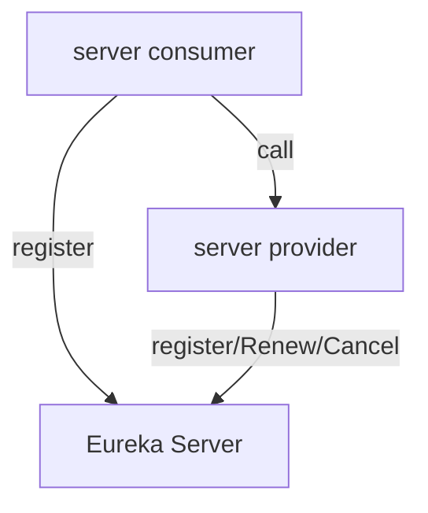

# 分布式
## 注册中心Eureka
用于服务的注册与发现
案例架构:
1. 一个服务提供者
2. 一个消费者
3. 服务者和消费者都注册到注册中心

相关依赖
```xml
<properties>
        <project.build.sourceEncoding>UTF-8</project.build.sourceEncoding>
        <maven.compiler.source>1.8</maven.compiler.source>
        <maven.compiler.target>1.8</maven.compiler.target>
        <junit.version>4.12</junit.version>
        <log4j.version>1.2.17</log4j.version>
        <lombok.version>1.16.18</lombok.version>
        <mysql.version>8.0.19</mysql.version>
        <druid.version>1.1.16</druid.version>
        <spring.boot.version>2.2.2.RELEASE</spring.boot.version>
        <spring.cloud.version>Hoxton.SR1</spring.cloud.version>
        <spring.cloud.alibaba.version>2.1.0.RELEASE</spring.cloud.alibaba.version>
        <mybatis.spring.boot.version>1.3.0</mybatis.spring.boot.version>
        <mybatis-spring-boot-starter.version>2.1.1</mybatis-spring-boot-starter.version>
        <xs.common>1.0-SNAPSHOT</xs.common>
    </properties>
    <!--子模块继承后,提供作用:锁定版本+子module不用groupId和version-->
    <dependencyManagement>
        <dependencies>
            <!--springboot 2.2.2-->
            <dependency>
                <groupId>org.springframework.boot</groupId>
                <artifactId>spring-boot-dependencies</artifactId>
                <version>${spring.boot.version}</version>
                <type>pom</type>
                <scope>import</scope>
            </dependency>
            <!--Spring cloud Hoxton.SR1-->
            <dependency>
                <groupId>org.springframework.cloud</groupId>
                <artifactId>spring-cloud-dependencies</artifactId>
                <version>${spring.cloud.version}</version>
                <type>pom</type>
                <scope>import</scope>
            </dependency>
            <!--Spring cloud alibaba 2.1.0.RELEASE-->
            <dependency>
                <groupId>com.alibaba.cloud</groupId>
                <artifactId>spring-cloud-alibaba-dependencies</artifactId>
                <version>${spring.cloud.alibaba.version}</version>
                <type>pom</type>
                <scope>import</scope>
            </dependency>
            <dependency>
                <groupId>mysql</groupId>
                <artifactId>mysql-connector-java</artifactId>
                <version>${mysql.version}</version>
            </dependency>
            <dependency>
                <groupId>com.alibaba</groupId>
                <artifactId>druid</artifactId>
                <version>${druid.version}</version>
            </dependency>
            <dependency>
                <groupId>org.mybatis.spring.boot</groupId>
                <artifactId>mybatis-spring-boot-starter</artifactId>
                <version>${mybatis-spring-boot-starter.version}</version>
            </dependency>
            <dependency>
                <groupId>org.projectlombok</groupId>
                <artifactId>lombok</artifactId>
                <version>${lombok.version}</version>
            </dependency>
            <dependency>
            <groupId>com.xs</groupId>
            <artifactId>cloud-commons</artifactId>
            <version>${xs.common}</version>
        </dependency>
        </dependencies>
    </dependencyManagement>
```
eureka配置:
单机版配置  
**依赖:**
```xml
<!--服务端-->
  <dependency>
        <groupId>org.springframework.cloud</groupId>
        <artifactId>spring-cloud-starter-netflix-eureka-server</artifactId>
    </dependency>
<!--客户端-->
<dependency>
    <groupId>org.springframework.cloud</groupId>
    <artifactId>spring-cloud-starter-netflix-eureka-client</artifactId>
</dependency>
旧版本
<dependency>
<groupId>org.springframework.cloud</groupId>
<artifactId>spring-cloud-starter-eureka</artifactId>
</dependency>
```
**注解:**
```xml
@EnableEurekaClient
@EnableEurekaServer
```
服务端配置:
```yaml
server:
  port: 7001
eureka:
  instance:
    hostname: localhost #服务端的实例名称
  client:
    # 不向注册中心注册自己
    register-with-eureka: false
    #    表示自己就是注册中心.维护服务实例,不去检索服务
    fetch-registry: false
    service-url:
      #      设置Eureka Server交互的地址查询和注册服务都需要依赖这个地址
      defaultZone: http://${eureka.instance.hostname}:${server.port}
```
客户端:
```yaml
eureka:
  client:
#    把自己注册到eurekaServer
    register-with-eureka: true
#    是否从eurekaService 抓取自己的注册信息,默认为true,单点无所谓,集群是设置为true,才能配合Robbie负载均衡
    fetch-registry: true
    service-url:
      defaultZone: http://localhost:7001/eureka
```
**集群配置:**
相互注册,相互守望:互相注册
修改host的配置
```yaml
127.0.0.1       xs-shuaieureka001.com
127.0.0.1       xs-shuaieureka002.com
```
两个注册中心相互注册
```yaml
server:
  port: 7001
eureka:
  instance:
    hostname: xs-shuaieureka001 #服务端的实例名称
  client:
    # 不向注册中心注册自己
    register-with-eureka: false
    #    表示自己就是注册中心.维护服务实例,不去检索服务
    fetch-registry: false
    service-url:
      #      设置Eureka Server交互的地址查询和注册服务都需要依赖这个地址
      defaultZone: http://localhost:7001/eureka/
```
**客户端的注册:**
```yaml
http://localhost:7002/eureka/,http://localhost:7001/eureka/
```
**消费者的配置:**
1.修改链接为服务名
2.resetTemplate 添加负载均衡
```java

@Configuration
public class ApplicationContextConfig {
    @Bean
    @LoadBalanced //负载均衡
    public RestTemplate getResetTemplate(){
        return new RestTemplate();
    }
}
```

主机名称和服务名称的配置:actuator
主机名称修改:
```yaml
eureka:
  client:
#    把自己注册到eurekaServer
    register-with-eureka: true
#    是否从eurekaService 抓取自己的注册信息,默认为true,单点无所谓,集群是设置为true,才能配合Robbie负载均衡
    fetch-registry: true
    service-url:
      defaultZone: http://localhost:7002/eureka/,http://localhost:7001/eureka/
 # 服务信息
  instance:
    instance-id: payment8001
# 访问信息ip信息提示
     prefer-ip-address: true
```

```java
@Resource
private DiscoveryClient discoveryClient;


 @GetMapping(value = "/payment/discovery")
    public CommonResult getDiscovery(){
        List<String> services = discoveryClient.getServices();
        
        List<ServiceInstance> instances = discoveryClient.getInstances("PRIVDER-PAYMENT-SERVICE");
        instances.stream().forEach(x->{
            log.info(x.getInstanceId()+
                    "主机:"+x.getHost()+
                    "端口:"+x.getPort()+
                    "url"+x.getUri());
        });
        return  CommonResult.okData(instances);
    }
```
Eureka的自我保护机制
1. 某一时刻微服务不可用,eureka不会立即清理,依旧会对该服务信息进行保护(AP)
2. 定时发送心跳包,在临时的没有接受到,不会立即删除
3. 宁可保留错误的信息,也不会盲目删除可能的健康服务实例

禁止自我保护:
```yaml
服务端
eureka: 
    server:
        rate-limiter-enabled: false
# 
        eviction-interval-timer-in-ms: 2000
#客户端
#eureka: 
  instance:
    instance-id: payment8001
    prefer-ip-address: true
#    向客户端发送的心跳时间间隔单位秒(默认30)
    lease-renewal-interval-in-seconds: 1
#      最后一次心跳等待的时间默认90秒  超时剔除
    lease-expiration-duration-in-seconds: 2
```

## Zookeeper
eureka停止更新,

```
zookeeper的安装:
进入容器,到bin目录下,启动
> ./zkCli.sh
进入
> ls /services 
查看注册的服务

```
节点是临时性的,在关闭服务一段时间丢失,再次注册服务的id变化
//todo

客户端配置
pom
```xml
<!--修改eureka-->
<!--     zookeeper   -->
        <dependency>
            <groupId>org.springframework.cloud</groupId>
            <artifactId>spring-cloud-starter-zookeeper-discovery</artifactId>
<!--     版本冲突       -->
<!--            <exclusions>-->
<!--                <exclusion>-->
<!--                    <groupId>org.apache.zookeeper</groupId>-->
<!--                    <artifactId>zookeeper</artifactId>-->
<!--                </exclusion>-->
<!--            </exclusions>-->
        </dependency>

```
yml
```yaml
server:
  port: 8004

spring:
  application:
#    服务名称
    name: privder-payment-service
  datasource:
    type: com.alibaba.druid.pool.DruidDataSource
    driver-class-name: com.mysql.cj.jdbc.Driver
    username: root
    password: root
    url: jdbc:mysql://192.168.0.109:3307/db_cloud?characterEncoding=utf8&zeroDateTimeBehavior=convertToNull&useSSL=false&allowMultiQueries=true&useJDBCCompliantTimezoneShift=true&useLegacyDatetimeCode=false&serverTimezone=Asia/Shanghai&allowPublicKeyRetrieval=true
  cloud:
    zookeeper:
      connect-string: 192.168.0.109:2181
```
启动类注解
```java
@EnableDiscoveryClient

```

## Consul 

go语言写的,

有一天可视化的界面
```
docker run -p 8500:8500/tcp consul agent -server -ui -bootstrap-expect=1 -client=0.0.0.0

```
配置
pom.xml
```xml
  <dependency>
            <groupId>org.springframework.cloud</groupId>
            <artifactId>spring-cloud-starter-consul-discovery</artifactId>
        </dependency>
```
yml
```yaml
spring:
  application:
    name: privder-payment-service
  cloud:
    consul:
      host: 192.168.0.109
      port: 8500
      discovery:
        service-name: ${spring.application.name}
```
启动类注解
```java
@SpringBootApplication
@EnableDiscoveryClient
public class Payment8006 {
    public static void main(String[] args) {
        SpringApplication.run(Payment8006.class,args);
    }
}
```

一致性:Consistency
可用性:available
分区容错性:Partition tolerance
三个的区别:CAP的区别  AP(eureka) CP(consul/zookeeper) 

## Ribbon
用于负载均衡,
依赖包含在:netflix client,不用特别的特别引入

resetTemplate:
ForObject

ribbon 的轮训算法
```
com.netflix.loadbalancer.RoundRobinRule  轮询
com.netflix.loadbalancer.RandomRule 随机
com.netflix.loadbalancer.RetryRule 先按照RoundRobinRule的策略获取服务,如果获取服务失败则在指定时间内进行重试,获取可用的服务
WeightedResponseTimeRule 对RoundRobinRule的扩展,响应速度越快的实例选择权重越多大,越容易被选择
BestAvailableRule	会先过滤掉由于多次访问故障而处于断路器跳闸状态的服务,然后选择一个并发量最小的服务
AvailabilityFilteringRule	先过滤掉故障实例,再选择并发较小的实例
ZoneAvoidanceRule	默认规则,复合判断server所在区域的性能和server的可用性选择服务器
```

自定义轮训算法

//todo

1. 新建一个包
2. 新建规则
3. 主启动类添加@RibbonClient 注解

算法: reset 自己次请求% 服务器的集群数量 =实际调用的服务器位置下标 
    重启后计数从1开始


## openFeign 
 feign 停止更新
 
**openFeign:** 一个声明式的web服务客户端,当web服务客户端变得容易,只创建一个接口,并添加注解即可
**作用:** 

区别:
服务调用者
1. 引入依赖 openFeign
```xml
 <dependency>
    <groupId>org.springframework.cloud</groupId>
    <artifactId>spring-cloud-starter-openfeign</artifactId>
</dependency>
```
2. 启动类 开启 @EnableFeignClients
3. 接口 @component  @FeignClient(value = "微服务名称"); 调用
```java
@Component
   @FeignClient(value = "PRIVDER-PAYMENT-SERVICE" )
   public interface OrderService {
   
       @GetMapping(value = "/payment/{id}")
        CommonResult get(@PathVariable("id") Long id );
   
       @PostMapping(value = "/payment/create")
       CommonResult create(@RequestBody Payment payment);
   
   }
``` 
4. 自带服务的负载均衡

超时控制:  
1. 默认的等待一秒钟 超时报错
2. 开启配置
```yaml
ribbon:
  # 指的是建立连接所用的时间,适用于网络状态正常的情况下,两端连接所用的时间
  ReadTimeout: 5000
  # 指的是建立连接后从服务器读取到可用资源所用的时间
  ConnectTimeout: 5000
```
日志打印:
日志级别:

1. 配置类
```java
@Configuration
public class FeignConfig {

/**
     * feignClient配置日志级别
     *
     * @return
     */
@Bean
public Logger.Level feignLoggerLevel() {
    // 请求和响应的头信息,请求和响应的正文及元数据
    return Logger.Level.FULL;
    }   
}
```
2. yml配置
```yaml

logging:
  level:
    # feign日志以什么级别监控哪个接口
    com.xs.service.PaymentFeignService: debug
```
## Hystrix
分布式系统中,会有延迟和容错的开源库,有时候会调用失败,超时,异常等信息.
Hystrix 保证依赖出问题的情况下,不会导致服务的失败,避免级联故障,提高分布式的弹性

服务的降级
服务熔断
服务的限流

概念:
- 降级 
  - 当别的不可用,有一个友好的提示 fallback
  - 那些出现降级    
- 熔断
  - 当访问量过大后,拒绝访问,并返回友好提示(保险丝)
- 限流 
  - 高并发情况下,进行 

 
 配置
 ```xml
     <!--hystrix-->
        <dependency>
            <groupId>org.springframework.cloud</groupId>
            <artifactId>spring-cloud-starter-netflix-hystrix</artifactId>
        </dependency>
```
jMeter 压力测试
Hystrix消费端和服务端都可以加入

服务降级:  
1. 超时
2. 对方挂机
3. 处理时间过长

服务端降级
配置:
````java
    @HystrixCommand(fallbackMethod = "payment_TimeOutHandler", commandProperties = {
            @HystrixProperty(name = "execution.isolation.thread.timeoutInMilliseconds", value = "3000")
    })
    public String paymentInfo_TimeOut(Integer id) {

    }

    /**
     * fallbackMethod
     * @param id
     * @return
     */
    public String payment_TimeOutHandler(Integer id) {
        return "线程池:" + Thread.currentThread().getName() + " 系统繁忙或运行错误,请稍后重试,id:" + id + "\t" + "o(╥﹏╥)o";
    }
//一旦调用失败,调用失败的方法
方法返回处理的方法
````
客户端降级:
配置文件
```yaml
feign:
  hystrix:
    # 在feign中开启Hystrix
    enabled: true
```
fallbackService接口
```java
@Component
//失败的调用接口
@FeignClient(value = "CLOUD-PROVIDER-HYSTRIX-PAYMENT",fallback = PaymentFallbackService.class)
public interface PaymentHystrixService {


    /**
     * 正常访问
     * @param id
     * @return
     */
    @GetMapping("/payment/hystrix/ok/{id}")
    String paymentInfo_OK(@PathVariable("id") Integer id);

    /**
     * 超时访问
     *
     * @param id
     * @return
     */
    @GetMapping("/payment/hystrix/timeout/{id}")
    String paymentInfo_TimeOut(@PathVariable("id") Integer id);

}


/***
*每个重写方法的失败回调
*/
@Component
public class PaymentFallbackService implements PaymentHystrixService {
    @Override
    public String paymentInfo_OK(Integer id) {
        return "----PaymentFallbackService fall back-paymentInfo_OK,o(╥﹏╥)o";
    }

    @Override
    public String paymentInfo_TimeOut(Integer id) {
        return "----PaymentFallbackService fall back-paymentInfo_TimeOut,o(╥﹏╥)o";
    }
}

```
Controller层

```java

@RestController
@Slf4j
//全局的通用的失败方法
@DefaultProperties(defaultFallback = "payment_Global_FallbackMethod")
public class OrderHystrixController {
    @Resource
    private PaymentHystrixService paymentHystrixService;


    /**
     * 正常访问
     * http://localhost/consumer/payment/hystrix/ok/32
     *
     * @param id
     * @return
     */
    @GetMapping("/consumer/payment/hystrix/ok/{id}")
    public String paymentInfo_OK(@PathVariable("id") Integer id) {
        return paymentHystrixService.paymentInfo_OK(id);
    }

    /**
     * 超时访问
     * 
     *
     * @param id
     * @return
     */
    @GetMapping("/consumer/payment/hystrix/timeout/{id}")
       //默认的失败处理方法
   /** @HystrixCommand(fallbackMethod = "paymentTimeOutFallbackMethod", 
        commandProperties = {
            @HystrixProperty(name = "execution.isolation.thread.timeoutInMilliseconds", value = "1500")
    })
    **/
    @HystrixCommand //不带参数是默认使用全局的
    public String paymentInfo_TimeOut(@PathVariable("id") Integer id) {
        //int age = 10/0;
        return paymentHystrixService.paymentInfo_TimeOut(id);
    }

    /**
     * 超时方法fallback
     * @param id
     * @return
     */
    public String paymentTimeOutFallbackMethod(@PathVariable("id") Integer id) {
        return "我是消费者80,对方支付系统繁忙请10秒种后再试或者自己运行出错请检查自己,o(╥﹏╥)o";
    }

    /**
     * 全局fallback
     *
     * @return
     */
    public String payment_Global_FallbackMethod() {
        return "Global异常处理信息,请稍后重试.o(╥﹏╥)o";
    }
}
```
启动类注解:@EnableHystrix


## 熔断
限流,提示,调用稳定后进行恢复链路

参数配置
```java

//====服务熔断

    /**
     * 在10秒窗口期中10次请求有6次是请求失败的,断路器将起作用
     * @param id
     * @return
     */
    @HystrixCommand(
            fallbackMethod = "paymentCircuitBreaker_fallback", commandProperties = {
            @HystrixProperty(name = "circuitBreaker.enabled", value = "true"),// 是否开启断路器
            @HystrixProperty(name = "circuitBreaker.requestVolumeThreshold", value = "10"),// 请求次数
            @HystrixProperty(name = "circuitBreaker.sleepWindowInMilliseconds", value = "10000"),// 时间窗口期/时间范文
            @HystrixProperty(name = "circuitBreaker.errorThresholdPercentage", value = "60")// 失败率达到多少后跳闸
    }
    )
```
**总结:** 
1. 状态:开放,半开,熔断
2. 错误百分比
3. 窗口期
4. 阈值 

仪表盘


## Zuul网关
zuul  
gateWay 新一代的网关,spring 2.0 之上
底层使用 webflux ,而webflux 使用netty

gateway 异步非阻塞式的  

传统的zuul,tomcat的阻塞式的处理流程

**三个概念:**
1. 路由(router):路由是构建网关的基本模块,它由ID,目标URI,一系列的断言和过滤器组成,如断言为true则匹配该路由
2. 断言(predicate):参考的是Java8的java.util.function.Predicate,开发人员可以匹配HTTP请求中的所有内容(例如请求头或请求参数),如果请求与断言相匹配则进行路由
3. 过滤(filter):指的是Spring框架中GatewayFilter的实例,使用过滤器,可以在请求被路由前或者之后对请求进行修改.

配置
pom.xml
```xml
    <dependency>
            <groupId>org.springframework.cloud</groupId>
            <artifactId>spring-cloud-starter-gateway</artifactId>
        </dependency>
        <dependency>
            <groupId>org.springframework.boot</groupId>
            <artifactId>spring-boot-devtools</artifactId>
        </dependency>
        <dependency>
            <groupId>org.projectlombok</groupId>
            <artifactId>lombok</artifactId>
            <optional>true</optional>
        </dependency>
        <dependency>
            <groupId>com.xs</groupId>
            <artifactId>cloud-commons</artifactId>
        </dependency>
        <!--        eureka-->
        <dependency>
            <groupId>org.springframework.cloud</groupId>
            <artifactId>spring-cloud-starter-netflix-eureka-client</artifactId>
        </dependency>
```
启动类:
```java
@SpringBootApplication
@EnableEurekaClient
public class GateWay9527
{
    public static void main(String[] args) {
        SpringApplication.run(GateWay9527.class,args);
    }
}
```
yaml配置
```yaml
server:
  port: 9527

spring:
  application:
    name: cloud-gateway
  cloud:
    gateway:
      discovery:
        locator:
          enabled: true # 开启从注册中心动态创建路由的功能，利用微服务名称j进行路由
      routes:
        - id: payment_route # 路由的id,没有规定规则但要求唯一,建议配合服务名
          #匹配后提供服务的路由地址
          uri: http://192.168.246.1:8001
#          uri: http://PRIVDER-PAYMENT-SERVICE
          predicates:
            - Path=/payment/** # 断言，路径相匹配的进行路由
        - id: payment_route2
          uri: http://192.168.246.1:8001
#          uri: http://PRIVDER-PAYMENT-SERVICE
          predicates:
            - Path=/payment/lb/** #断言,路径相匹配的进行路由


eureka:
  instance:
    hostname: cloud-gateway-service
  client:
    fetch-registry: true
    register-with-eureka: true
    service-url:
      defaultZone: http://localhost:7002/eureka/,http://localhost:7001/eureka/
```
服务名的访问:
pom.xml
```xml
<dependency>
            <groupId>org.springframework.cloud</groupId>
            <artifactId>spring-cloud-starter-netflix-eureka-client</artifactId>
        </dependency>
```
yml:需要注意的是uri的协议lb,表示启用Gateway的负载均衡功能.

**Predicate**  
协议转换，路由转发
流量聚合，对流量进行监控，日志输出
作为整个系统的前端工程，对流量进行控制，有限流的作用
作为系统的前端边界，外部流量只能通过网关才能访问系统
可以在网关层做权限的判断
可以在网关层做缓存

包含了 after before between cookie header host method 


```xml
- After=2017-01-20T17:42:47.789-07:00[America/Denver]
- Before=2017-01-20T17:42:47.789-07:00[America/Denver]
- Cookie=username,zzyy //cookie 
- Header=X-Request-Id, \d+ #请求头要有X-Request-Id属性，并且值为正数
- Host=**.atguigu.com
- Method=GET  //方法请求方式
- Query=username, \d+ # 要有参数名username并且值还要是正整数才能路由
```

**filter**  
在请求前后进行过滤

全局拦截器 
```java
@Component
@Slf4j
public class MyLogGatewayFilter implements GlobalFilter, Ordered {

    @Override
    public Mono<Void> filter(ServerWebExchange exchange, GatewayFilterChain chain) {
        log.info("come in global filter: {}", new Date());

        ServerHttpRequest request = exchange.getRequest();
        String uname = request.getQueryParams().getFirst("uname");
        if (uname == null) {
            log.info("用户名为null，非法用户");
            exchange.getResponse().setStatusCode(HttpStatus.NOT_ACCEPTABLE);
            return exchange.getResponse().setComplete();
        }
        // 放行
        return chain.filter(exchange);
    }

    /**
     * 过滤器加载的顺序 越小,优先级别越高
     *
     * @return
     */
    @Override
    public int getOrder() {
        return 0;
    }
}
```
## gateWay

//todo

## 分布式配置中心
配置中心,统一的配置管理中心(中心化的配置)
* 一个独立的服务
 * 集中管理配置文件
 * 不同环境不同配置，动态化的配置更新，分环境部署比如dev/test/prod/beta/release
 * 运行期间动态调整配置，不再需要在每个服务部署的机器上编写配置文件，服务会向配置中心统一拉取配置自己的信息
 * 当配置发生变动时，服务不需要重启即可感知到配置的变化并应用新的配置
 * 将配置信息以REST接口的形式暴露

配置中心配置:
1. 新建仓库
2. 配置git 
3. pom.xml
```xml
  <dependencies>
   <!-- springCloud Config -->
   <dependency>
     <groupId>org.springframework.cloud</groupId>
     <artifactId>spring-cloud-config-server</artifactId>
   </dependency>
   <!-- 避免Config的Git插件报错：org/eclipse/jgit/api/TransportConfigCallback  -->
   <dependency>
       <groupId>org.eclipse.jgit</groupId>
       <artifactId>org.eclipse.jgit</artifactId>
       <version>4.10.0.201712302008-r</version>
   </dependency>
   <!-- 图形化监控 -->
   <dependency>
     <groupId>org.springframework.boot</groupId>
     <artifactId>spring-boot-starter-actuator</artifactId>
   </dependency>
   <!-- 熔断 -->
   <dependency>
     <groupId>org.springframework.cloud</groupId>
     <artifactId>spring-cloud-starter-hystrix</artifactId>
   </dependency>
   <dependency>
     <groupId>org.springframework.cloud</groupId>
     <artifactId>spring-cloud-starter-eureka</artifactId>
   </dependency>
   <dependency>
     <groupId>org.springframework.cloud</groupId>
     <artifactId>spring-cloud-starter-config</artifactId>
   </dependency>
   <dependency>
     <groupId>org.springframework.boot</groupId>
     <artifactId>spring-boot-starter-jetty</artifactId>
   </dependency>
   <dependency>
     <groupId>org.springframework.boot</groupId>
     <artifactId>spring-boot-starter-web</artifactId>
   </dependency>
   <dependency>
     <groupId>org.springframework.boot</groupId>
     <artifactId>spring-boot-starter-test</artifactId>
   </dependency>
   <!-- 热部署插件 -->
   <dependency>
     <groupId>org.springframework</groupId>
     <artifactId>springloaded</artifactId>
   </dependency>
   <dependency>
     <groupId>org.springframework.boot</groupId>
     <artifactId>spring-boot-devtools</artifactId>
   </dependency>
  </dependencies> 

```
4. yaml
```yaml
server: 
  port: 3344 
  
spring:
  application:
    name:  microservicecloud-config
  cloud:
    config:
      server:
        git:
          uri: git@github.com:zzyybs/microservicecloud-config.git #GitHub上面的git仓库名字
           search-paths:
              - spring-config
        label: master #分支

eureka:
  client:
    service-url:
      defaultZone: http://eureka7001.com:7001/eureka

```
5. 启动类
```java
@SpringBootApplication
@EnableConfigServer
public class ConfigCenterMain3344 {
    public static void main(String[] args) {
        SpringApplication.run(ConfigCenterMain3344.class, args);
    }
}
```

启动注册中心,启动配置中心

配置的读取规则:
label :分支
application:服务名称
profile: 环境后缀
{label}/{application}-{profile}.yml
{application}/{profile}[/{label}]
{label}/{application}-{profile}.yml

**客户端配置:**  
bootstrap.yml:系统级优先级更高
application.yml
```yaml
server:
  port: 3355

spring:
  application:
    name: config-client
  cloud:
    config:
      label: master # 分支名称
      name: config #配置文件名称
      profile: dev # 读取的后缀，上述三个综合，为master分支上的config-dev.yml的配置文件被读取，http://config-3344.com:3344/master/config-dev.yml
      uri: http://config-3344.com:3344 #配置中心的地址

eureka:
  client:
    service-url:
      defaultZone: http://eureka7001.com:7001/eureka
```

pom.xml
```xml
   <dependency>
            <groupId>org.springframework.cloud</groupId>
            <artifactId>spring-cloud-starter-config</artifactId>
        </dependency>
```
启动类:
```java
@SpringBootApplication
@EnableEurekaClient
public class ConfigClientMain3355 {
    public static void main(String[] args) {
        SpringApplication.run(ConfigClientMain3355.class, args);
    }
}
```

动态刷新的配置
客户端: 
pom.xml:
```xml
 <dependency>
            <groupId>org.springframework.boot</groupId>
            <artifactId>spring-boot-starter-actuator</artifactId>
        </dependency>
```
配置监控端点
```yaml
management:
  endpoints:
    web:
      exposure:
        include: "*"
```
刷新的标签:
@RefreshScope业务类Controller修改
运维发起请求,刷新接口

## 消息总线
spring config bus

rabbitmq环境

安装:
```shell script
>mkdir rabbitmq
>chomd 1000 rabbitmq/
>docker run -d --hostname rabbit-svr --name rabbit -p 5672:5672 -p 15672:15672 -p 25672:25672 -v /var/rabbitmq:/var/lib/rabbitmq rabbitmq:management
```
账号是:guest 密码也是guest

通知:1.客户端 2.服务端(通知全部), 进行全部的通知 
服务端: 配置rabbitmq 
```yaml
spring:
  rabbitmq:
    host: 192.168.0.109
    port: 5672
    username: guest
    password: guest
# 暴露bus刷新配置的端点

management:
  endpoints:
    web:
      exposure:
        include: "bus-refresh"
```
需要配置依赖:
```xml
  <dependency>
       <groupId>org.springframework.boot</groupId>
       <artifactId>spring-boot-starter-actuator</artifactId>
   </dependency>
```
客户端消息总线:
```xml
 <dependency>
            <groupId>org.springframework.cloud</groupId>
            <artifactId>spring-cloud-starter-bus-amqp</artifactId>
        </dependency>
<dependency>
            <groupId>org.springframework.boot</groupId>
            <artifactId>spring-boot-starter-actuator</artifactId>
</dependency>
```
yml配置
```yaml
spring:
  rabbitmq:
    host: 192.168.0.109
    port: 5672
    username: guest
    password: guest
management:
  endpoints:
    web:
      exposure:
        include: "*"
```
动态刷新的定点通知:
http://localhost:配置中心端口号/actuator/bus-refresh/{destination}
/bus/refresh请求不再发送到具体的服务实例上,而是发给config server并通过destination参数类指定需要重新配置的服务或实例
destination:微服务名:端口号

## 消息驱动

使用一种适配绑定的方式,在mq中切换,屏蔽底层信息中间件的差异,降低切换成本,统一消息的编程模型
目前支持 kafka  

发布订阅模式

spring Cloud Stream 

生产者
pom.xml
```xml
 <dependencies>
        <dependency>
            <groupId>org.springframework.boot</groupId>
            <artifactId>spring-boot-starter-web</artifactId>
        </dependency>
        <dependency>
            <groupId>org.springframework.boot</groupId>
            <artifactId>spring-boot-starter-actuator</artifactId>
        </dependency>

        <dependency>
            <groupId>org.springframework.cloud</groupId>
            <artifactId>spring-cloud-starter-netflix-eureka-client</artifactId>
        </dependency>

        <dependency>
            <groupId>org.springframework.cloud</groupId>
            <artifactId>spring-cloud-starter-stream-rabbit</artifactId>
        </dependency>

        <dependency>
            <groupId>org.projectlombok</groupId>
            <artifactId>lombok</artifactId>
            <optional>true</optional>
        </dependency>
        <dependency>
            <groupId>org.springframework.boot</groupId>
            <artifactId>spring-boot-starter-test</artifactId>
            <scope>test</scope>
        </dependency>
```
yaml
```yaml
server:
  port: 8801

spring:
  application:
    name: cloud-stream-provider
  cloud:
    stream:
      binders: # 在此处配置要绑定的rabbitMQ的服务信息
        defaultRabbit: # 表示定义的名称，用于binding的整合
          type: rabbit # 消息中间件类型
          environment: # 设置rabbitMQ的相关环境配置
            spring:
              rabbitmq:
                host: localhost
                port: 5672
                username: guest
                password: guest
      bindings: # 服务的整合处理
        output: # 这个名字是一个通道的名称
          destination: studyExchange # 表示要使用的exchange名称定义
          content-type: application/json # 设置消息类型，本次为json，文本则设为text/plain
          binder: defaultRabbit # 设置要绑定的消息服务的具体设置

eureka:
  client:
    service-url:
      defaultZone: http://eureka7001.com:7001/eureka
  instance:
    lease-renewal-interval-in-seconds: 2 # 设置心跳的间隔时间，默认30
    lease-expiration-duration-in-seconds: 5 # 超过5秒间隔，默认90
    instance-id: send-8801.com # 主机名
    prefer-ip-address: true # 显示ip
```
接口:
```java
public interface IMessageProvider {
    /**
     * 消息发送
     * @return
     */
    String send();
}
@EnableBinding(Source.class)
public class MessageProviderImpl implements IMessageProvider {

    /**
     * 消息发送管道
     */
    @Resource
    private MessageChannel output;

    @Override
    public String send() {
        String serial = UUID.randomUUID().toString();
        output.send(MessageBuilder.withPayload(serial).build());
        System.out.println("serial = " + serial);
        return serial;
    }
}
```
消费者:
pom.xml 一样

yaml:
```yaml
server:
  port: 8802

spring:
  application:
    name: cloud-stream-consumer
  cloud:
    stream:
      binders: # 在此处配置要绑定的rabbitMQ的服务信息
        defaultRabbit: # 表示定义的名称，用于binding的整合
          type: rabbit # 消息中间件类型
          environment: # 设置rabbitMQ的相关环境配置
            spring:
              rabbitmq:
                host: localhost
                port: 5672
                username: guest
                password: guest
      bindings: # 服务的整合处理
        input: # 这个名字是一个通道的名称
          destination: studyExchange # 表示要使用的exchange名称定义
          content-type: application/json # 设置消息类型，本次为json，文本则设为text/plain
          binder: defaultRabbit # 设置要绑定的消息服务的具体设置
          group: spectrumrpcA # 分组 

eureka:
  client:
    service-url:
      defaultZone: http://eureka7001.com:7001/eureka
  instance:
    lease-renewal-interval-in-seconds: 2 # 设置心跳的间隔时间，默认30
    lease-expiration-duration-in-seconds: 5 # 超过5秒间隔，默认90
    instance-id: receive-8802.com #主机名
    prefer-ip-address: true # 显示ip
```
订阅部分:
```java
@Component
@EnableBinding(Sink.class)
public class ReceiveMessageListenerController {
    @Value("${server.port}")
    private String serverPort;

    @StreamListener(Sink.INPUT)
    public void input(Message<String> message){
        System.out.println("消费者1号，----->接收到的消息："+ message.getPayload() +"\t port:" + serverPort);
    }
}
```

分组消费和持久化:
重复消费问题:
不同的组可以消费,同一个组会发生竞争关系,只会有一个可以消费

自定义分组:

持久化: 

## 请求链路追踪
zipkin安装 


 


